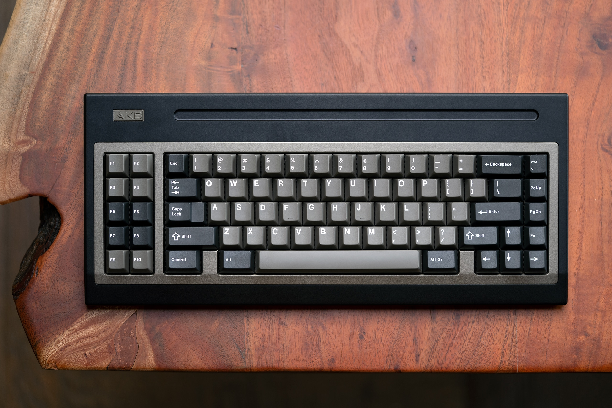
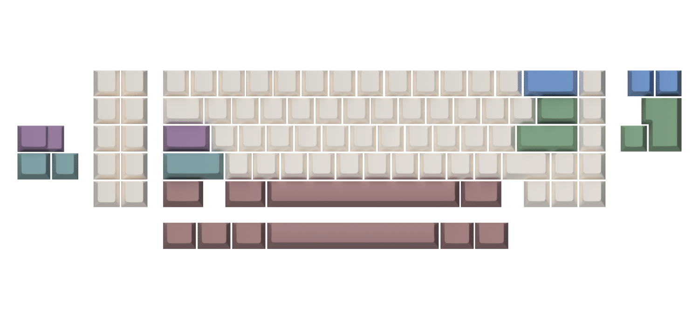
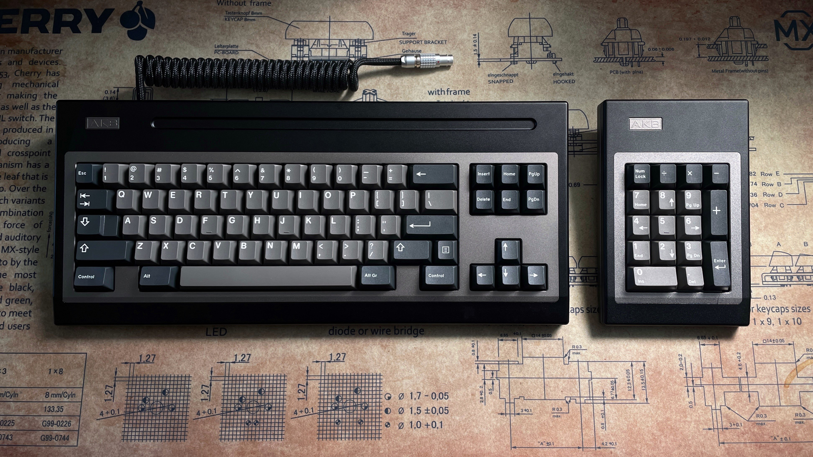

# AKB OGR

The OGR was originally designed as an entry for the OG Summer competition on [r/customkeyboards](https://www.reddit.com/r/CustomKeyboards/) in 2019, which it thankfully won. It was originally inspired by various vintage keyboards, but chiefly the [Cherry/NCR G81-3077](https://deskthority.net/wiki/Cherry_G81-3077) for the iconic Cherry nose, the pronounced seam and the large forehead. It also drew inspiration from the Cherry G80-0832 for the accented piece around the keycaps to give it a truly unique look. The name is a portmanteau of OG Summer and NCR, whose branding on the aforementioned G81-3077 was also the inspiration for the retro-styled AKB logo. While the PCB is USB-C compatible, the port is enclosed deep inside the case and the case parts gently clamp the cable down to give the aesthetic of a hard-wired cable.

* [Website](https://alchemistkeyboards.com/projects/keyboards/ogr/)
* [Geekhack](https://geekhack.org/index.php?topic=117142.0)

## Specifications

* Inspired by [Cherry G81-3077/G80-0832](https://deskthority.net/wiki/Cherry_G81-3077)
* 10° typing angle
* Full 6063 aluminium construction
* Bead-blasted and anodised finish
* Top mounted, leaf-spring carbon fibre plate
* 21.5mm effective [front height](./images/dimensions.png) (with bumpons)
* QMK and VIA-compatible USB-C PCBs
* Integrated cable aesthetic
* Period-authentic product [stickers](./images/stickers.jpg)
* 2.9kg (6.5lbs) unbuilt

## Layout support

## Kit contents

* 1× Top Case – 6063 Aluminium
* 1× Bottom Case – 6063 Aluminium
* 1× Accent – 6063 Aluminium
* 1× Plate – Carbon fiber leaf spring
* 1× Badge – 6063 Aluminium
* 1× Solder PCB – Black FR4 with green solder mask
* 1× EVA plate foam
* 4× [AKB Bumpons](https://github.com/akb-repos/feet) – Injection molded silicone
* 1× Bottom sticker
* 1× Split cable grommet
* 10× Torx button screw M3×6mm in A2 stainless steel (plate)
* 5× Torx button screw M3×6mm in A2 stainless steel (accent)
* 6× Torx button screw M3×12mm in A2 stainless steel (case)
* 2× Torx countersunk screw M3×5mm in A2 stainless steel (badge)
* 1× Instruction manual
* 1× Carry Case

## FRL addon kit

*Photo by Dyno*

## Media

### Build streams
* [Lulzthax](https://www.youtube.com/watch?v=Cb8pBFlr4Sg)

### Typing tests
* [Koen Romers - OGR with lubed Tecsee Diamonds](https://www.youtube.com/watch?v=xzYC1VplEiY)
* [Lulzthax - Alphas Oil Kings on Carbon Fibre - plate foam no case foam](https://www.youtube.com/watch?v=a3AjGGwpqXY)
* [Lulzthax - Mods Oil Kings on Carbon Fibre - plate foam no case foam](https://www.youtube.com/watch?v=5E183Ajj7Q8)
