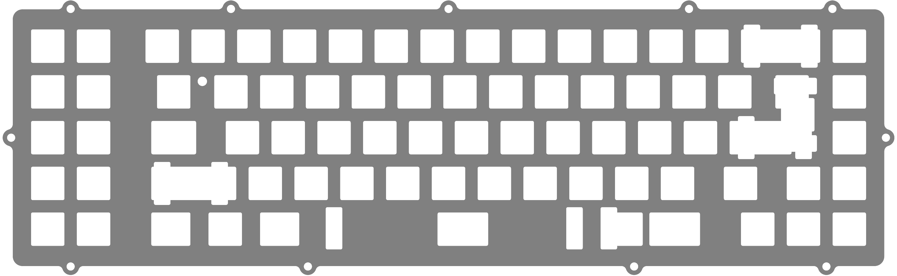

# 65% XT Plates

### OGR_Leaf_Spring_Plate_Default
Leaf-spring cuts (ideal for CF)

* [OGR_Leaf_Spring_Plate_Default.step](./OGR_Leaf_Spring_Plate_Default.step)
* [OGR_Leaf_Spring_Plate_Default.dxf](./OGR_Leaf_Spring_Plate_Default.dxf)

### OGR_Large_Cuts_Plate
Large cuts (ideal for metals)

* [OGR_Leaf_Spring_Plate_Default.step](./OGR_Large_Cuts_Plate.step)
* [OGR_Leaf_Spring_Plate_Default.dxf](./OGR_Large_Cuts_Plate.dxf)

### OGR_No_Cuts_Plate
No cuts (ideal for flexible plastics)

* [OGR_Leaf_Spring_Plate_Default.step](./OGR_No_Cuts_Plate.step)
* [OGR_Leaf_Spring_Plate_Default.dxf](./OGR_No_Cuts_Plate.dxf)

# FRL plates

### OGR_Leaf_Spring_Plate_Default
Leaf-spring cuts (ideal for CF)

* [OGR_FRL_TKL_Plate_Leaf_Spring.step](./OGR_FRL_TKL_Plate_Leaf_Spring.step)
* [OGR_FRL_TKL_Plate_Leaf_Spring.dxf](./OGR_FRL_TKL_Plate_Leaf_Spring.dxf)